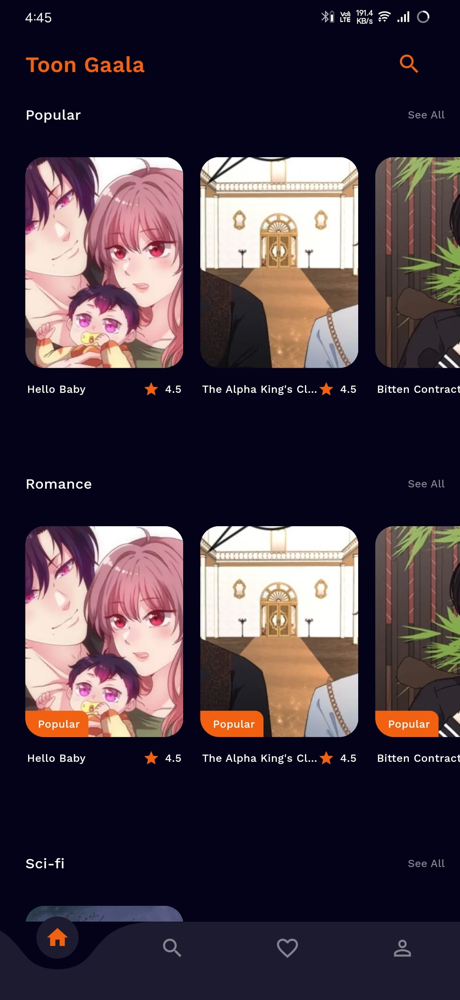
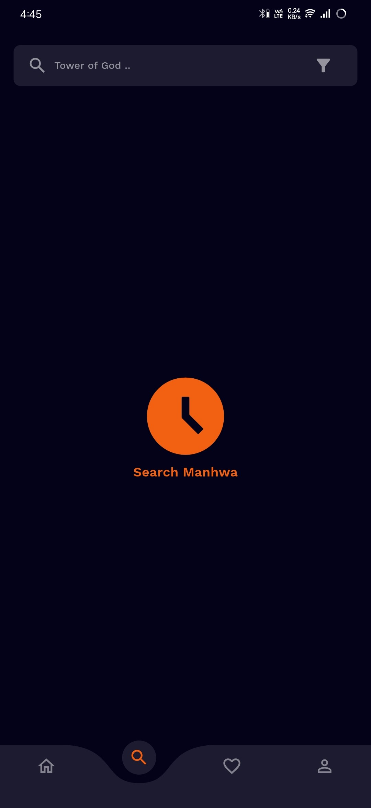
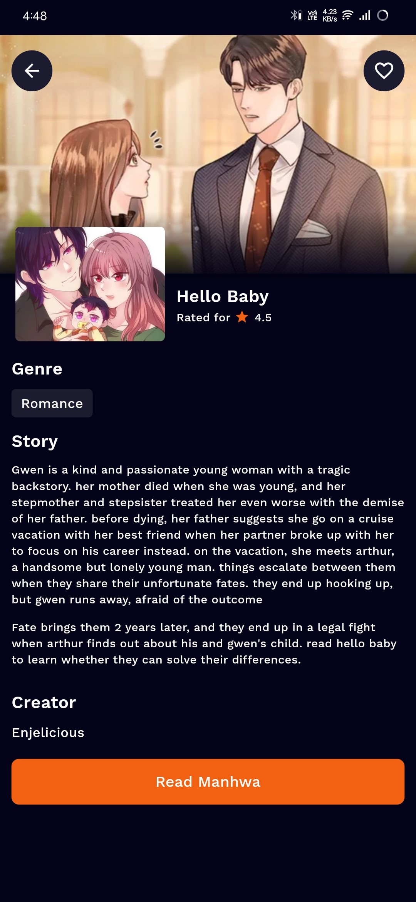
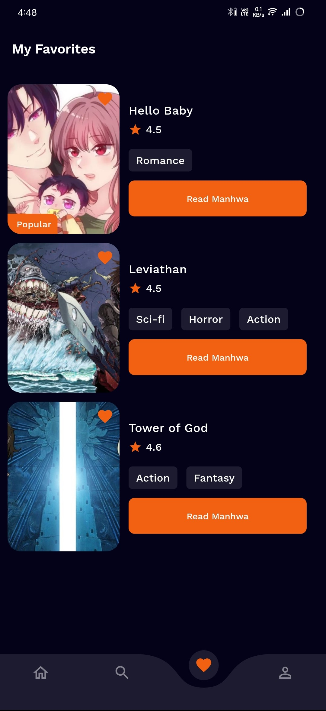
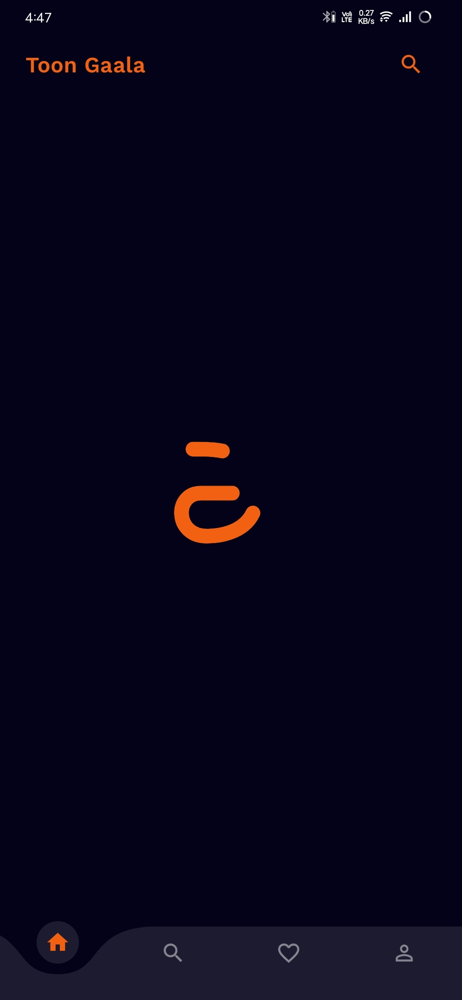
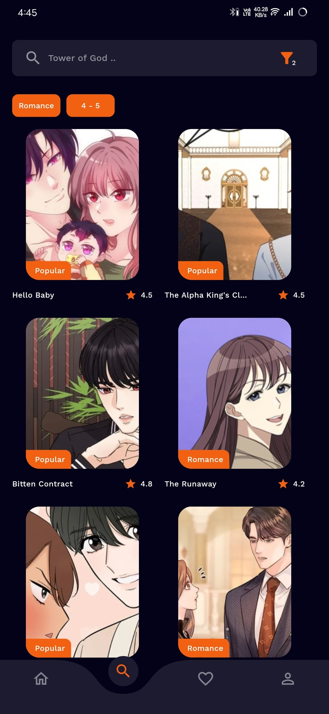

# Toon Gaala

**Toon Gaala** is your gateway to a vast collection of **Korean Mangas**! Whether you're a seasoned reader or new to the world of manhwa, this app offers a comprehensive library of your favorite series. Explore, discover, and dive into the best of Korean storytelling, all within an intuitive and user-friendly interface. Users can also save their favorite mangas locally for easy access!

## Features

- **Huge Manga Collection:** Access a wide range of Korean mangas, from classics to the latest releases.
- **Search & Filter:** Easily search for mangas by genre, status, and ratings.
- **Favorites System:** Add mangas to your favorites list for quick access, stored locally in **Hive**.
- **Offline Access:** Enjoy your favorite mangas even when you're offline with local storage using Hive.
- **Interactive UI:** Simple and clean interface to enhance your manga reading experience.

## Getting Started

### Prerequisites

Ensure you have the following installed:
- [Flutter](https://flutter.dev/docs/get-started/install) (for mobile development)
- [Dart SDK](https://dart.dev/get-dart) (if not bundled with Flutter)

### Installation

1. **Clone the repository:**

   ```bash
   https://github.com/Navin82005/Webtoon-Explorer-App.git

2. **Navigate into the project directory:**

   ```bash
   cd webtoon_explorer

3. **Install dependencies:**

   ```bash
   flutter pub get

4. **Run the app:**

   ```bash
   flutter run

## Project Structure

```
/toon-gaala
│
├── /lib                   # Main source files
│   ├── /controller         # GetX controllers for app state management
│   ├── /model              # Data models such as Manga
│   ├── /view               # UI components and pages
│   └── main.dart           # App entry point
│
└── /assets                 # Images, icons, and other assets
```

## Local Storage

This app uses **Hive** for local storage. Users can store their favorite mangas locally for easy access, even offline. The storage is lightweight and fast, ensuring a seamless experience when managing your manga collection.

## App Screenshots

Here are some screenshots demonstrating the app features:

| Home Page                     | Search Page                     | Manga Details                | Favorites List               |
| ------------------------------ | ------------------------------ | ---------------------------- | ---------------------------- |
|  |  |  |  |
|||||


## Contributing

If you'd like to contribute to **Toon Gaala**, please fork the repository and use a feature branch. Pull requests are warmly welcome!

1. Fork it (https://github.com/your-username/toon-gaala/fork)
2. Create your feature branch (`git checkout -b feature/YourFeature`)
3. Commit your changes (`git commit -m 'Add YourFeature'`)
4. Push to the branch (`git push origin feature/YourFeature`)
5. Create a new Pull Request

## License

This project is licensed under the MIT License. See the [LICENSE](LICENSE) file for details.

## Contact

For any inquiries or feedback, feel free to reach out:

- **Name:** Naveen N
- **Email:** navin82005@gmail.com
- **GitHub:** [Navin82005](https://github.com/Navin82005/)

---

Explore the world of **Manhwa** with **Toon Gaala** and save your favorites locally for endless entertainment!
